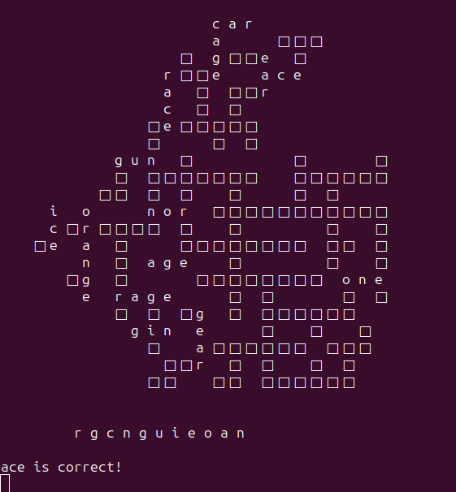

# Pyscape
**Wordscape on python**

## Description
I recreated the mobile game, Wordscape, on python. Using a random English word from a list, the program creates a Scrabble-like table of all the words that can be made up of the letters from the initial random word. Users are then prompted to guess the censored words on the board given the scrambled letters.


  
## Instructions
You can use one of the lists of words in this repo. I have two: 
  - wordlist.txt that contains 20042 words.
  - smallwordlist.txt contains 9124 words.

Wordlist is an extenstion of smallwordlist, and contains many uncommon words which makes it too hard. Smallwordlist has too few words, and limits creativity. I've been searching for a word list with a balance of the two, but haven't been able to find one, so feel free to make one yourself. I also have a few dictionarys commented out; they require the following pip install:
  
  **For the english-words library containing 235970 words**
  ```
  pip install english-words
  ```
  **For the nltk.corpus library containing 236736 words**
  ```
  pip install nltk.corpus
  ```

I find these dictionaries have far too many uncommon words, which makes then very difficult to play with. However, they do create some very large and cool boards.

## Inspiration
  This project was inspired by my mom, who is on level 2504 on Wordscape. I thought it would be a fun and technically challenging coding project. I’m currently working on making a more user-friendly display, instead of the terminal.
  
## Credits
  Shoutout to my wonderful mother that unintentionally gave me the idea. Also, credits to my gym partner, Declan, for helping me with a specific problem I was having with the print_board function.
